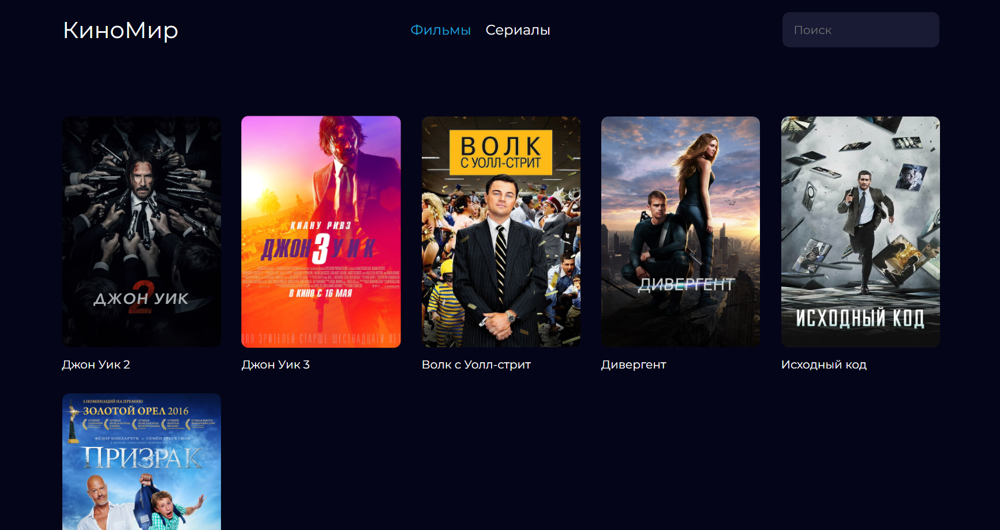
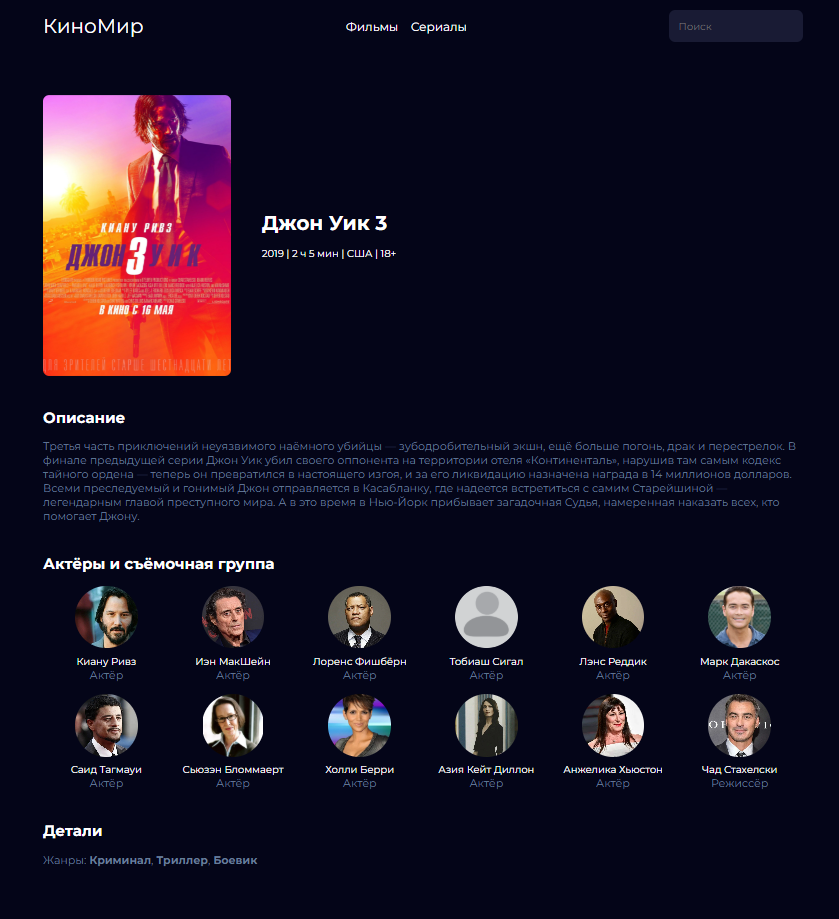

# КиноМир

**КиноМир** - это информационный сайт о фильмах и сериалах.





# Содержание

- **[Технологии и инструменты](#технологии-и-инструменты)**
- **[Установка и запуск](#установка-и-запуск)**
- **[API](#api)**

## Технологии и инструменты

### Языки программирования и фреймворки

- **Python 3.11**
- **Django 5**
- **Django REST Framework (DRF)**

### Инструменты разработки
- **Mypy**
- **Flake8**
- **Black**
- **Isort**
- **Pre-commit**
- **Poetry**
- **Git**
- **GitHub**

### Базы данных
- **Redis**
- **PostgreSQL**

### Web технологии
- **HTML**
- **CSS**
- **JavaScript**
- **JQuery**

### Контейнеризация
- **Docker**
- **Docker Compose**

### Серверные технологии и безопасность
- **Gunicorn**
- **Nginx**
- **CSP**
- **HTTPS**
- **The nginx version is disabled**

### Фоновая обработка задач
- **Celery**


## Установка и запуск

### 1. Создайте .env в корневом каталоге проекта или запустите файл init_env.py:

```shell
python init_env.py
```

or

```dotenv
# .env

# DJANGO SECRET KEY
SECRET_KEY=...

# DJANGO DEBUG
DEBUG=False

# DATABASE CONNECT SETTINGS
POSTGRES_DB=...
POSTGRES_USER=...
POSTGRES_PASSWORD=...
POSTGRES_HOST=database# docker container name

# REDIS CONNECT SETTINGS
REDIS_LOCATION=redis://redis:6379# redis container name

# SMTP
EMAIL_HOST_USER=...
EMAIL_HOST_PASSWORD=...
```

### 2. Добавьте свой IP и DOMAIN в коллекцию ALLOWED_HOSTS в settgins.py и nginx/nginx.conf:

```python3.11
#  KinoMir/settings.py

ALLOWED_HOSTS: List[str] = [
    "127.0.0.1",
    "YOUR IP",
    "YOUR DOMAIN",
    "YOUR www.DOMAIN"
```

### 3. Соберите docker compose:
```shell
sudo docker compose up --build
```

### 4. Получите сертификат (при первом запуске):
```
sudo docker run -it --rm \
  -v "./nginx/certbot:/var/www/certbot" \
  -v "/etc/letsencrypt:/etc/letsencrypt" \
  certbot/certbot certonly \
  --webroot \
  --webroot-path=/var/www/certbot \
  -d DOMAIN \
  -d www.DOMAIN \
  --email EMAIL \
  --agree-tos \
  --no-eff-email
```

**Примечание:** *Вы можете получить сертификат только при запущенном сервере.*

### 5. Необходимо раскомментировать части кода в nginx/nginx.conf. Затем пересобрать docker compose:

```shell
sudo docker compose up --build
```

## API

OpenAPI - ```api/redoc/```

### 1. Получить список фильмов

```api/movies/```


### 2. Получить список сериалов

```api/serials/```
